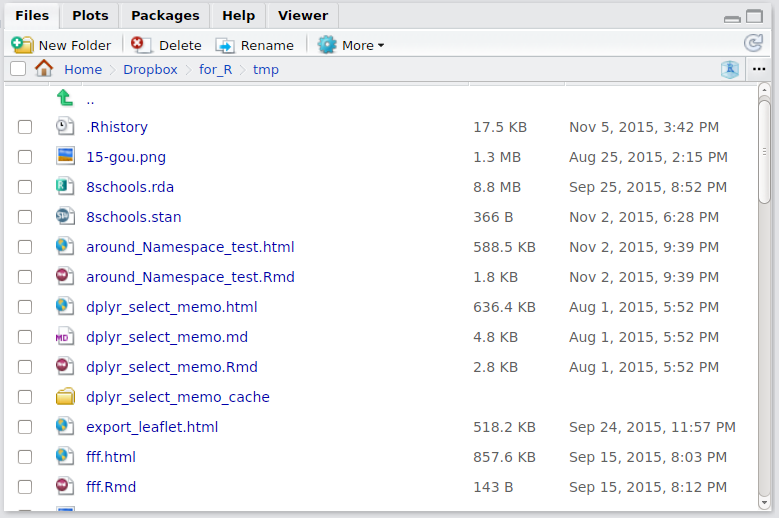
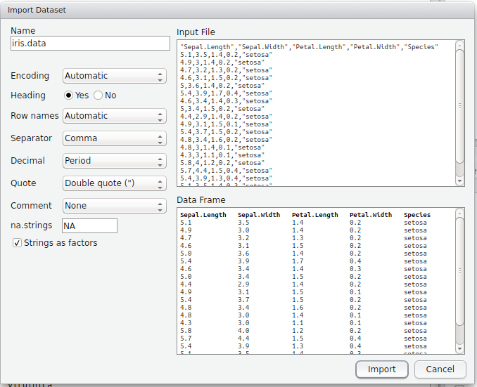

```{r setup, include=FALSE}
knitr::opts_chunk$set(echo = TRUE)
```

**注意: こちらはまだ暫定版です。当日(2018/03/21)までに変更の可能性があります。ご了承ください。**

# RとRStudioに触れてみよう

## R(RStudio)の起動と画面

RStudioを早速起動させましょう。RStudioは主に4つの部分(pane)に分かれています:


### 左下: Console


Rを対話的に操作するところです。コマンドを記述して実行します。Rに対して「これをやれ」と指示を出し、その結果もまたここに出てきます。

### 左上: Source Editor


Rのスクリプトやファイルなどを編集する場所です。ここで各種ファイルを開き、コードを編集して保存したり、そのコードを実行します。ここでコードを実行すると、その内容がConsoleへ順次送られて実行されます。

通常、ここでRスクリプトファイル(*.R)を作成して、それを実行して作業をしていきます。よって、おそらくは多くの場合ここが一番利用するところとなるでしょう。

### 右下: File, Plots, Packages, Helpなど



#### File

ディレクトリ(フォルダ)にアクセスします。各ファイルをクリックするとその場で開くことができます。また名前の変更やディレクトリ作成などもできます。

#### Plots

グラフなどを出力すると、ここに表示されます。ある程度遡れますし、ここから画像などにエクスポートすることもできます。

#### Packages

Rの拡張パッケージを管理できます。**Rはパッケージがポイント**になるので、頻繁に利用します。「パッケージとは何か」については後述します。

#### Help

ヘルプウィンドウで、Rの関数などを検索したり、その組み込みのヘルプを閲覧することができます。ただあまりここから検索することは少なく、Consoleで `?help` というようにしてヘルプを表示させるのがメインです

### 右上: Environment, Historyなど


#### Environment

Rの**環境**を表示します。とりあえずは「今Rで読み込んだり作ったりしてるデータや変数といったものが見れる」と考えておいてください。

#### History

Consoleで実行した内容の履歴です。ここから再度Consoleに送ったり、Scriptに送ったりすることもできます。

# ファイルからデータの読み込み

Rにデータを読み込む方法を説明します。なおここでは手元にあるファイルから読み込む方法について触れます。リレーショナル・データベースを利用する方法やWebから取得する方法については割愛します。

## csvファイルからの読み込み

一番基本的な方法となります。大きく2つの方法があります。

### `read.csv()`関数を利用

例えば、現在の作業ディレクトリに`iris-data.csv`というファイルがあるとします。これを読み込む場合、以下のコマンドを実行します。

```{r}
iris.data <- read.csv("iris-data.csv")
```

これを実行すると、`iris.data`というオブジェクトにcsvファイルの中身が読み込まれます。この場合、以下のような状態となります:

- 1行目が変数名として読み込まれる
- `NA`という文字を欠損値となる
- 空欄が欠損値となる
- (欠損扱いではない)数値ではない値は文字列として認識
    - 文字列が含まれる列は(他に数値があっても)全て文字列と判定
    - デフォルトの設定では、**Factor型として処理**される

主なデフォルト設定も含めて丁寧に書くと以下のようになります:

```{r}
iris.data <- read.csv(file = "iris-data.csv", header = TRUE, na.strings = "NA", stringsAsFactors = default.stringsAsFactors())
```

主な引数を説明は以下の通りです:

- file: ファイル名(ファイルパス)。作業ディレクトリからの相対パスで指定します。
- header: 変数名を読み込むかどうか。`TRUE`なら1行目を変数名として読み込みます。
- na.strings: 欠損値として処理したい値を指定。
    - たとえば欠損値として`999`とか指定して入力していたならば、`na.strings = "999"`
    - 複数ある場合は、`na.strings = c("999", "-1")`という感じで指定
- stringAsFactors: 文字列の変数をFactor型にするかどうか。
    - `TRUE`ならば文字列を含む変数は全てFactor型として処理
    - `FALSE`ならば文字列を含む変数は全てCharacter型として処理
    - 標準でRで設定してあるのは`TRUE`
    - 個人的には`FALSE`にしておいて、必要に応じてその変数をFactor型に切り替えてます

### RStudioの**import Dataset**を利用

RStudioを利用すれば、マウス操作でデータセットを読み込むことができます。

**Environment**タブのところにある**import Dataset**をクリックし、**From Local File...**をクリックします


その後、以下のダイアログボックスで指定していきます:



ポイントになるところの説明です:

- Name: 読み込んだデータを格納するオブジェクト名
- Encoding: 文字コードを指定します。問題なければそのままで。
- Heading: 1行目を変数名として読み込むかどうか。
- NA Strings: NAにする文字列。上述の通り
- Strings as Factors: 文字列をFactor型にするかどううか。上述の通り。

つまり、コードでやるのをGUIでできる、というイメージです。慣れないうちはこちらのほうがスムーズかもしれません。慣れてきたら`read.csv()`などコードで読み込ませるのをおすすめします。

## Excelファイルからの読み込み

Rは標準ではExcelファイルを直接読み込めませんが、{readxl}パッケージを利用すると直接読み込むことができるようになります:

```{r, eval=FALSE}
# パッケージをインストールしてなければインストール
# install.packages(readr)
library(readxl)
xl_df_1 <- read_excel("xl_data.xlsx", sheet = "df_1")
```

第一引数が読み込むファイル名、第二引数が読み込むシートです。日本語のデータも対応しているので、特に問題なくいけます。.xlsと.xlsxの両方共に対応し、マシンにExcelがなくても読み込めます。

## SPSSファイル(.sav)からの読み込み

Rは標準ではSPSSのファイルを直接読み込めませんが、{haven}パッケージを利用すると直接読み込むことができるようになります:

```{r, eval=FALSE}
# パッケージをインストールしてなければインストール
# install.packages(haven)
library(haven)
sav_df <- read_sav("hoge.sav")
```

引数には.savファイルを指定してください。なおSPSSにはラベル機能がありますが、この情報は削除されて読み込まれます(たぶん)。

## その他

大量のデータを読み込む場合、`read.csv()`などでは処理に時間がかかることがあります。高速にデータを読み込むために{readr}などが開発されています。気になる方は調べてみてください。

また、開発版(Preview版)のRStudioでは**Import Dataset**ボタンからcsv, Excel, SPSSなどを選択してデータをインポートできるようになっています(2016/07/16現在)。これらは上記で紹介したパッケージを組み込んだ機能で、GUIにてデータを読み込めるようになります。これは次回の通常版のアップデートで組み込まれるでしょう。

このようにRStudioを利用すれば簡単にデータを読みこませることができますが、**極力スクリプトにコードを記述して、データを読みこませる**ようにしてください。この方が「どのデータを読み込んだのか」といったことが明確になり、ファイルを取り違えるといった分析者のミスが減少するからです。

# まずはとにかく触ってみよう

まず、Rを使うとどんな感じになるのか、試しに触ってみましょう。それぞれの解説については後述します。


## データ構造を確認

Environmentのところにある`iris.data`をクリックすると、そのデータセットを見ることができます。


また、Consoleで以下のコードを入力してEnterで実行しましょう:

```{r}
str(iris.data)
```

`iris.data`として読み込んだデータの内容が表示されます。細かいところは省略しますが、大体はつかめるかと思います。

## 集計

それでは、現在Rにある`iris.data`というデータセットについて、平均や中央値、最大最小など集計してみましょう。Consoleで以下のコードを入力して実行してください:

```{r}
summary(iris.data)
```

各変数の基礎統計が算出され、表示されたかと思います。

## 分析

それでは、Speciesを独立変数、Sepal.Lengthを従属変数とする1要因3水準の分散分析を実施してみます:

```{r}
result <- aov(Sepal.Length ~ Species, data = iris.data)
```

これで分散分析の結果がresultに入ってます。ではこの結果の分散分析表を確認します:

```{r}
summary(result)
```

それではこれを多重比較してみます。まずはholmで:

```{r}
pairwise.t.test(iris.data$Sepal.Length, iris.data$Species)
```

次にTukeyのHSDで:

```{r}
TukeyHSD(result)
```

## 図示

これらの結果を図示します。まずは各水準ごとで要約統計量算出:

```{r}
by(iris.data$Sepal.Length, iris.data$Species, summary)
```

これを箱ひげ図でプロット:

```{r}
plot(iris.data$Species, iris.data$Sepal.Length)
```

# まとめと参考文献

[WIP]

# session info

```{r, child="_session_info.Rmd"}

```

